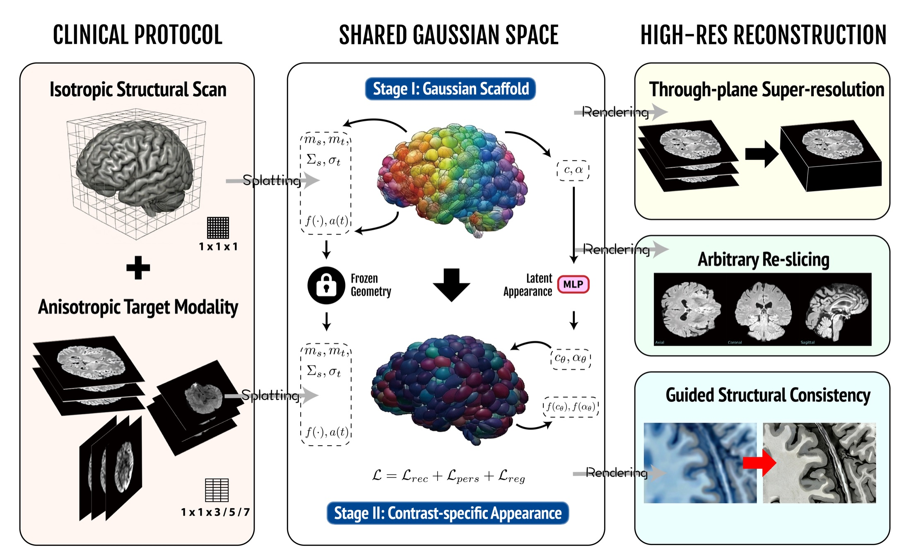
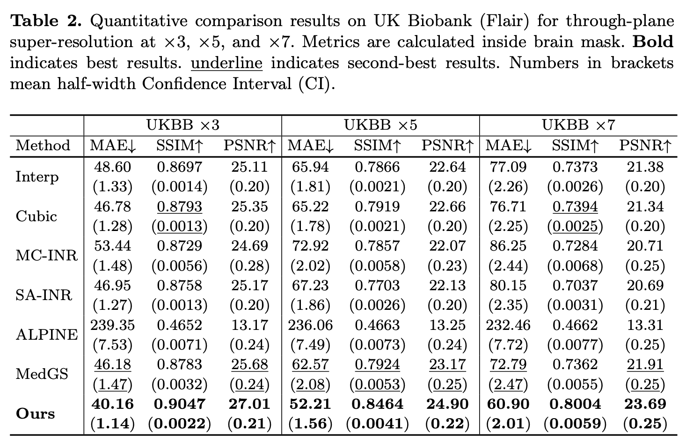

# AtlasGS [](https://www.python.org/) [](https://arxiv.org/abs/2606.02961)

Shared Gaussian Geometry for Brain MRI Spatial Resolution Harmonization Without External Training.

AtlasGS is a research codebase for multi-contrast brain MRI through-plane super-resolution with Gaussian Splatting. It learns a subject-specific Gaussian geometry from an isotropic T1-weighted scan, then reuses that geometry to reconstruct sparse, thick-slice target modalities such as FLAIR, T2w, DWI, and ASL.

- [arXiv Paper](https://arxiv.org/abs/2606.02961)
- [Source Code](https://github.com/yfgao76/AtlasGS)

## Overview

AtlasGS uses the commonly acquired isotropic T1-weighted image as an anatomical scaffold for target-modality resolution harmonization. The method first fits explicit Gaussian geometry from the T1 scan, then adapts target-modality appearance from low-resolution observations while preserving structural consistency.

Key capabilities:

- Geometry-guided reconstruction without external target-modality training.
- Multi-contrast target fitting for FLAIR, T2w, DWI, and ASL.
- Through-plane super-resolution experiments across UK Biobank, UPenn-GBM, and ABCD-derived cohorts.
- Reproducible scripts for interpolation, INR, MedGS, AtlasGS variants, LR-consistency fusion, ablation, and evaluation.



## Table of Contents

- [Overview](#overview)
- [News](#news)
- [1. Experiment Variants](#1-experiment-variants)
- [2. Quick Start and Implementation Guidance](#2-quick-start-and-implementation-guidance)
  - [2.1 Installation](#21-installation)
  - [2.2 Data Preparation](#22-data-preparation)
  - [2.3 Running Paper Experiments](#23-running-paper-experiments)
  - [2.4 Evaluation](#24-evaluation)
- [3. Documentation: data preparation, training, and evaluation entrypoints](#3-documentation-data-preparation-training-and-evaluation-entrypoints)
- [4. Performance: paper results](#4-performance-paper-results)
- [5. Data Availability](#5-data-availability)
- [6. Citation](#6-citation)
- [7. Resources](#7-resources)
- [8. Acknowledgements](#8-acknowledgements)

## 1. Experiment Variants

This repository provides entrypoints for the paper's subject-specific MRI harmonization experiments.

| Study | Target modalities | Degradation | Main entrypoint |
| --- | --- | --- | --- |
| UK Biobank | FLAIR | z-axis x3, x5, x7 | `atlasgs/experiments/run_ukbb_all_methods_z7.sbatch` |
| UPenn-GBM | T2w, FLAIR | z-axis x7 | `atlasgs/experiments/run_gbm_all_methods_z7.sbatch` |
| ABCD-derived | DWI, ASL | factor x3 | `atlasgs/experiments/run_hcp_all_methods_z3.sbatch` |
| Single subject | configurable | configurable | `python -m atlasgs.experiments.run_subject` |

Summary: use the dataset-level SLURM scripts to reproduce paper-scale runs, and use `run_subject` for debugging or single-case experiments.

## 2. Quick Start and Implementation Guidance

> **Implementation guidance:** run commands from the repository root, keep controlled-access datasets outside version control, set `MEDGS_ROOT` before baseline runs, and write generated checkpoints/metrics under ignored output directories such as `outputs_dataset/`.

### 2.1 Installation

Create a Python environment with a CUDA-enabled PyTorch build that matches your system, then install AtlasGS in editable mode.

```bash
git clone https://github.com/yfgao76/AtlasGS.git
cd AtlasGS
python -m pip install -e .
```

Training requires PyTorch and a working MedGS installation. AtlasGS calls MedGS training and rendering code directly; pass its path with `--medgs-root` or set `MEDGS_ROOT` in the experiment scripts.

### 2.2 Data Preparation

AtlasGS expects one directory per subject and a split CSV with a `subject_id` column.

```text
data/ukbb_medgs/
  train.csv
  test.csv
  <subject_id>/
    t1_gt.nii.gz
    flair_gt.nii.gz
    flair_lr_1x1x7.nii.gz
    mask_brain.nii.gz
```

Prepare UK Biobank T1/FLAIR pairs:

```bash
python -m atlasgs.ops.prepare_ukbb_medgs \
  --src /path/to/ukbb/source \
  --out data/ukbb_medgs
```

Prepare ABCD/HCP-style ASL-DWI data:

```bash
SRC_ROOT=/path/to/PT008_AdolescentBrainDevelopment \
SYNTHSTRIP_SIF=/path/to/freesurfer.sif \
sbatch atlasgs/experiments/prepare_hcp.sbatch
```

Prepare GBM T2/FLAIR data:

```bash
SRC_ROOT=/path/to/GBM_Dataset \
sbatch atlasgs/experiments/prepare_gbm.sbatch
```

`SYNTHSTRIP_SIF` is required only when HCP preparation uses SynthStrip skull stripping. Use `NO_SKULLSTRIP=1` to skip that step.

### 2.3 Running Paper Experiments

Run UK Biobank FLAIR experiments at z-axis factors 3, 5, and 7:

```bash
MEDGS_ROOT=/path/to/MedGS \
sbatch atlasgs/experiments/run_ukbb_all_methods_z7.sbatch
```

Run ABCD/HCP-style ASL-DWI experiments at factor 3:

```bash
MEDGS_ROOT=/path/to/MedGS \
sbatch atlasgs/experiments/run_hcp_all_methods_z3.sbatch
```

Run GBM T2/FLAIR experiments at factor 7:

```bash
MEDGS_ROOT=/path/to/MedGS \
sbatch atlasgs/experiments/run_gbm_all_methods_z7.sbatch
```

Run one subject directly:

```bash
python -m atlasgs.experiments.run_subject \
  --subject-id <subject_id> \
  --data-root data/ukbb_medgs \
  --out-root outputs_dataset/ukbb_medgs_all_methods/z7 \
  --medgs-root /path/to/MedGS \
  --target-modalities flair \
  --factor-z 7 \
  --interp-factor 7 \
  --run-t1guided-latent \
  --run-t1guided-topology \
  --run-t1guided-our \
  --run-lr-fusion
```

### 2.4 Evaluation

Aggregate UK Biobank metrics and external INR/SA-INR baselines:

```bash
INR_BASE=/path/to/external_metrics/brain-gs \
sbatch atlasgs/experiments/run_analyze_ukbb_with_external_inr.sbatch
```

Compute GBM and ABCD table metrics:

```bash
sbatch atlasgs/experiments/run_analyze_gbm_abcd_table.sbatch
```

Generate UK Biobank orthogonal-plane overlays:

```bash
INR_ROOT=/path/to/inr_ukbb_ds7 \
SA_ROOT=/path/to/sa_inr_ukbb_ds7 \
sbatch atlasgs/experiments/run_ukbb_overlays_orth_z7_all.sbatch
```

## 3. Documentation: data preparation, training, and evaluation entrypoints

| Guide | Description |
| --- | --- |
| `atlasgs/ops/` | Data preparation, degradation, NIfTI/frame conversion, and resampling utilities |
| `atlasgs/train/` | AtlasGS and baseline training modules |
| `atlasgs/experiments/` | Single-subject, dataset-level, and SLURM experiment entrypoints |
| `atlasgs/eval/` | Metric aggregation, ablation analysis, overlays, and figure utilities |
| `atlasgs/models/` | Lightweight INR and regularization modules |
| `examples/` | Minimal input templates |

Generated data, checkpoints, renders, metrics, logs, and external baselines are intentionally kept out of version control. The default ignored output locations are `data/`, `outputs/`, `outputs_dataset/`, `outputs_contribution/`, `external/`, and `external_metrics/`.

## 4. Performance: paper results

Table 2 reports UK Biobank FLAIR through-plane super-resolution at x3, x5, and x7. AtlasGS achieves the best MAE, SSIM, and PSNR across all three degradation factors.



## 5. Data Availability

This repository does not redistribute clinical or controlled-access MRI datasets. Use the preparation scripts with data obtained through the appropriate dataset access agreements.

## 6. Citation

If you use AtlasGS, please cite:

```bibtex
@misc{gao2026atlasgs,
  title  = {Shared Gaussian Geometry for Brain MRI Spatial Resolution Harmonization Without External Training},
  author = {Gao, Yifan and Xu, Peiran and He, Yimeng and Li, Haoran and Long, Ziyang and Li, Debiao},
  year   = {2026},
  note   = {Manuscript in preparation}
}
```

## 7. Resources

- [AtlasGS source code](https://github.com/yfgao76/AtlasGS)
- [arXiv paper](https://arxiv.org/abs/2606.02961)

## 8. Acknowledgements

AtlasGS was developed for research on multi-contrast brain MRI harmonization. The authors acknowledge the computational resources and support used for the paper experiments.
